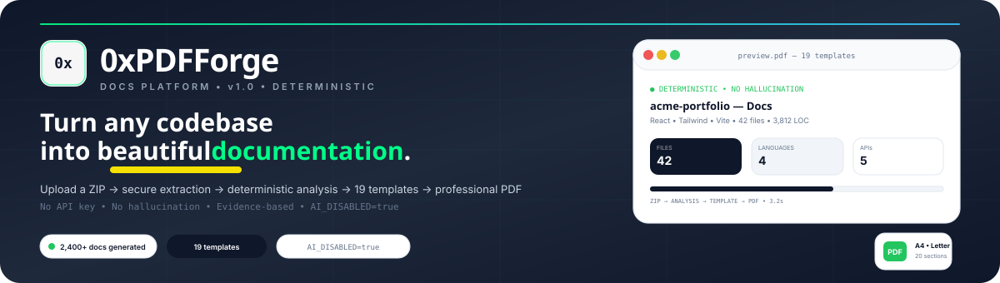
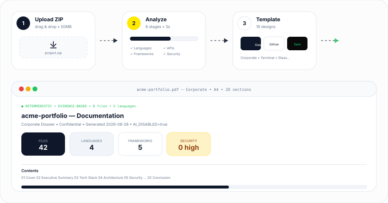
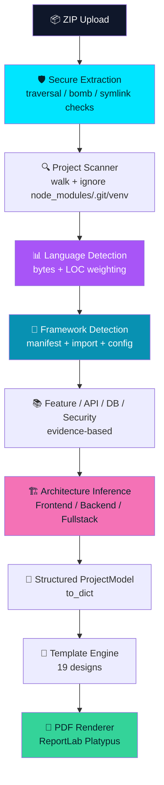

<div align="center">


<br/>

<a href="https://github.com/0xAbhi13/0xPDFForge">
  
</a>

<br/><br/>

[](https://www.python.org/)
[](https://fastapi.tiangolo.com/)
[](https://www.reportlab.com/)
[](https://pillow.readthedocs.io/)


<br/>

**Created by Abhishek Jadhav — [@0xAbhi13](https://github.com/0xAbhi13)**

</div>


<div align="center">

### 📚 Table of Contents

[⚡ About](#-what-is-0xpdfforge) • [✨ Features](#-features) • [🎨 Templates](#-template-gallery) • [🧠 How It Works](#-how-it-works) • [📦 Install](#-installation) • [▶️ Usage](#️-usage) • [⌨️ Editor Shortcuts](#️-editor-shortcuts) • [🗂️ Structure](#️-project-structure) • [🔒 Security](#-security) • [🛣️ Roadmap](#️-future-roadmap) • [📄 License](#-license)

</div>


<div align="center">



</div>

<br/>

## ⚡ What is 0xPDFForge?

**0xPDFForge** turns any project ZIP into a polished, professional PDF — no API key, no hallucination, no guesswork. Every number, framework, feature and diagram is derived from **actual file contents** with a confidence model:

`Confirmed` → manifest evidence &nbsp;|&nbsp; `Detected` → import / config &nbsp;|&nbsp; `Inferred` → heuristic &nbsp;|&nbsp; `Unknown` / `N/A` → explicitly marked or omitted

> **Example:** `contact.js` alone does **not** mean a contact form — the analyzer inspects source before claiming. Secrets are redacted with `***` and never appear verbatim in the PDF.

<div align="center">

```text
> Initializing 0xPDFForge...
> ZIP validated               ✓  (no traversal / bomb / symlink)
> Files discovered            ✓  42 files • 6 dirs
> Languages detected          ✓  JS 62% • HTML 18% • CSS 12%
> Frameworks detected         ✓  React • Vite • Tailwind
> Architecture inferred       ✓  Browser → Frontend → API
> PDF generated               ✓  Corporate • A4 • 20 sections
> 0xPDFForge ready. Download PDF ↓
```

</div>

<br/>

<div align="center">

</div>

<div align="center">



</div>

## ✨ Features

<table>
<tr>
<td width="33%" align="center">

### 🔍
**Deterministic Analyzer**
Languages by bytes + LOC, 30+ frameworks, manifests, website UI, APIs, DBs, security — all evidence-based.

</td>
<td width="33%" align="center">

### 🎨
**19 Templates**
Developer / Professional / Academic / Creative — each with unique typography, cover, spacing, headers/footers.

</td>
<td width="33%" align="center">

### 📄
**20 Dynamic Sections**
Cover → Executive Summary → … → Conclusion. Omitted or marked “No evidence” when absent.

</td>
</tr>
<tr>
<td width="33%" align="center">

### ✏️
**Visual PDF Editor**
Reorder (drag-drop), hide/show, edit text per section, switch template, A4/Letter, live preview.

</td>
<td width="33%" align="center">

### 🛡️
**Secure ZIP Pipeline**
Traversal, bomb (ratio >1000), symlink, oversize (50 MB / 10 MB per file / 10k files) — all blocked.

</td>
<td width="33%" align="center">

### 🔒
**Secret Redaction**
API keys, AWS, Stripe, GitHub PAT, passwords → `***` before analysis and never in PDF.

</td>
</tr>
<tr>
<td width="33%" align="center">

### 📊
**Real Statistics**
Files, source files, LOC, bytes, deps, frameworks, assets/images/tests/docs, largest files/dirs, build scripts — measured, not invented.

</td>
<td width="33%" align="center">

### 🧩
**Architecture Diagram**
Inferred `User → Frontend → API → Backend → DB` from detected layers, rendered as vector.

</td>
<td width="33%" align="center">

### ⚡
**Local-First**
`AI_DISABLED=true` by default. No cloud, no execution, no upload. Works offline on a normal PC.

</td>
</tr>
</table>

<div align="center">

### 🔒 Local Processing

All analysis happens on your machine. **Nothing is uploaded or executed.** The PDF is rendered locally with ReportLab.

</div>

## 🎨 Template Gallery

<div align="center">

| Category | Templates | Vibe |
|:---|:---|:---|
| **Developer** | Terminal, GitHub, Cyber, Architecture, Minimal Code | Mono, dark, blueprint, minimal |
| **Professional** | Corporate, Executive, Modern Portfolio, Case Study | Navy+gold, charcoal+teal, cream, left-rule |
| **Academic** | College Project, Internship Report, Research Report, Technical Report | Crest, certificate, serif, spec-sheet |
| **Creative** | Neon, Glass, Editorial, Magazine, Timeline, **ChatGPT** | Synthwave, frosted, editorial, grid, timeline, chat bubbles |

*Each has unique typography (Helvetica/Times/Courier), spacing (compact/comfortable/airy), cover, section layouts, cards, diagrams, headers/footers — not just color swaps.*

</div>

> **ChatGPT template** — clean Inter, chat bubbles, code blocks with `copy`, green `#10A37F` accent — same quality standards ChatGPT uses for professional PDFs.

## 🧠 How It Works



The analyzer never executes uploaded code. The PDF renderer consumes only the structured `ProjectModel` — analysis stays separate from presentation. Every table uses header shading + zebra rows, every code block uses dark `#0F172A` with language label, every image has a caption box.

## 🧰 Tech Stack

<div align="center">


</div>

## 📦 Installation

<details open>
<summary><b>🖱️ Click to expand setup steps</b></summary>

<br/>

**1. Clone the repo**

```bash
git clone https://github.com/0xAbhi13/0xPDFForge.git
cd 0xPDFForge
```

**2. Create a virtual environment**

```bash
python -m venv venv
```

<table>
<tr><th>Windows</th><th>macOS / Linux</th></tr>
<tr>
<td>

```bash
venv\Scripts\activate
```

</td>
<td>

```bash
source venv/bin/activate
```

</td>
</tr>
</table>

**3. Install dependencies**

```bash
pip install -r requirements.txt
# or editable install with CLI
pip install -e .
```

**4. Run (choose one)**

```bash
# Windows double-click
start.bat
# macOS / Linux
chmod +x start.sh && ./start.sh
# Direct
python -m uvicorn backend.app:app --host 127.0.0.1 --port 8000
# CLI (no browser)
python cli.py --zip examples/sample-project.zip --template corporate --output docs.pdf
```

Then open `http://127.0.0.1:8000` — try **“Try sample project →”** for instant demo.

> Works with `AI_DISABLED=true` by default. No `OPENAI_API_KEY` needed.

</details>

## ▶️ Usage

```text
1. Landing → “Analyze Project”
2. Upload → drag & drop ZIP (max 50 MB, 10k files, 10 MB/file — bombs/traversal blocked)
3. Analysis → live 8-stage progress (real pipeline callbacks)
4. Results → stack, stats, features, architecture, tree, APIs, DBs, security
5. Templates → filter by category, search, select (19 previews)
6. Editor → reorder/hide (drag-drop), edit text, switch template, A4/Letter, add custom, live preview
7. Generate → download PDF (page numbers, metadata, redacted secrets)

Try: examples/sample-project/ → ZIP it and upload, or click “Try sample project →”
```

## ⌨️ Editor Shortcuts

<div align="center">

| Action | How | Action | How |
|:---|:---|:---|:---|
| Reorder sections | Drag `≡` | Hide / Show | Toggle switch |
| Edit text | Click `✎` | Add custom | Bottom textarea → `+ Add section` |
| Change template | Right panel → Template | Page size | Top bar `A4` / `Letter` |
| Reset | `Reset` top of left panel | Generate | `Generate PDF` → download |

</div>

## 🗂️ Project Structure

```text
0xPDFForge/
│
├── frontend/                 # SPA — no build step, fully responsive
│   ├── index.html
│   └── assets/{app.js,favicon.svg}
├── backend/
│   └── app.py                # FastAPI — upload, analyze, generate, serve
├── analyzer/
│   ├── config.py             # limits & ignored dirs (configurable)
│   ├── pipeline.py           # orchestration with progress callbacks
│   ├── models.py             # ProjectModel dataclasses
│   ├── scanners/{safe_extract.py,walker.py}
│   └── detectors/{language,framework,dependencies,features,api_detector,database,security,architecture}.py
├── templates/
│   └── definitions.py        # 19 templates (Developer/Professional/Academic/Creative)
├── pdf/
│   └── engine.py             # ReportLab — ChatGPT-quality tables, code blocks, headers/footers
├── cli.py                    # CLI —  python cli.py --zip proj.zip --template corporate
├── docs/{banner-animated.svg,demo-animated.svg}
├── examples/{sample-project/,sample-project.zip,example-*.pdf}
├── tests/                    # pytest — extraction, detectors, pdf, api
├── screenshots/capture.py    # Playwright stub (graceful fallback)
├── requirements.txt / pyproject.toml / Dockerfile
├── start.bat / start.sh
└── README.md
```

## 🔒 Security

- **ZIP:** traversal (`..`), absolute `/`, drive `:`, symlink `0xA000`, bomb ratio >1000, oversize, count — rejected with `ExtractionError`
- **Secrets:** `api_key`, `AWS`, `sk_live`, `ghp_`, `password` → `***` via `analyzer/detectors/security.py:12`; never in PDF (`pdf/engine.py:22 esc()` + `_safe_para`)
- **Filenames:** `re.sub(r'[^A-Za-z0-9._-]','_', name)` — `test & demo <app>` → `test___demo__app` for safe `Content-Disposition`
- **Execution:** never `eval` uploaded files; preview sandboxed `npm run dev` with timeout, fallback static
- **Cleanup:** extracted dirs auto-removed after 10 min, ZIP deleted

**Wording:** “Static scan detected…” — never “This project is secure.”

## 📊 PDF Quality — ChatGPT Standards

ChatGPT-level best practices applied in `pdf/engine.py:650`:

- **Typography:** scale `Cover 32/36`, `H1 16/18`, `H2 12/14`, `Body 8.5/12` (justified for Academic), `Mono 6.5/8` dark `#0F172A` for code, `Caption 7/9`
- **Layout:** `A4/Letter` `36/48` margins, `KeepTogether`, `Spacer` baseline grid, `HRFlowable` dividers
- **Tables:** `_styled_table` — header `primary`/`white` `Helvetica-Bold`, `ROWBACKGROUNDS` zebra, `BOX 0.5` + `INNERGRID 0.25`, caption `italic 6pt`
- **Code:** `_code_block` — header `language — copy` + body `Courier` on `#0F172A`/`#E2E8F0` with `esc()` + `&nbsp;` + `<br/>`
- **Images:** `_image_placeholder` bordered `card` box with caption
- **Callouts:** `_callout` left `3pt` border (note/warning/danger) for security findings
- **Page design:** `SimpleDocTemplate` + `_cover_background` per template (grid for dark, gold bar for Corporate, blueprint border for Architecture) + `_header_footer` (page `— N —`, `Confidential`)

## 🛣️ Future Roadmap

- [x] 19 templates + ChatGPT quality
- [ ] Playwright screenshot engine (sandboxed desktop + mobile)
- [ ] More analyzers (Dart, Swift, Kotlin) — see `analyzer/detectors/`
- [ ] AI optional (`OPENAI_API_KEY` env, `AI_DISABLED=false` fallback)
- [ ] PDF diff / version history
- [x] CLI `python cli.py --zip` + Docker `Dockerfile:1`

<div align="center">

</div>

## 👨‍💻 Author

<div align="center">

### Abhishek Jadhav

Creator of **0xPDFForge** & **0xAirCanvas** — building creative projects with Python, AI, computer vision, and web technologies.

[](https://github.com/0xAbhi13)
[](https://linkedin.com/in/0xAbhi13)

</div>

## 📄 License

Released under the [MIT License](LICENSE).

<div align="center">


**Made with 📄 and deterministic analysis.**

</div>
